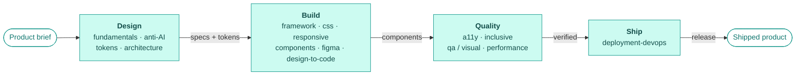

<div align="center">

# Full-Stack Design Skills · Iron Software

**A set of 15 authored Claude skills for UX/UI + frontend engineering** — from first-principles design through tokens, components, accessibility, and shipping — tuned for **React · Astro · Vue** on **Tailwind CSS v4**.

<p>
  
  
  
  
  
  
  
</p>

</div>

---

## What this is

Claude *skills* are packaged instructions Claude loads on demand for a specific kind of task. This repo holds a coherent UX/UI + frontend skill set: each is a folder under [`.claude/skills/`](.claude/skills) with a `SKILL.md` (and, where depth helps, a `references/` folder loaded progressively).

They share one spine — **layered design tokens → consistent component APIs → accessibility & inclusion as defaults → measured quality gates → reliable shipping** — and cross-link so following one naturally hands off to the next.

## How the skills compose

Not a flat list — they flow from a brief to a shipped product, each phase handing off to the next.



## The 15 skills

### 🎨 Design
| Skill | What it does |
|-------|--------------|
| **design-fundamentals** | Diagnose & fix a UI from first principles — hierarchy, grid, color, type, spacing, balance. |
| **anti-ai-design-patterns** | Catch the "tells" that make a UI look machine-generated; make it read as handcrafted. |
| **design-tokens-system** | A layered token system (primitive → semantic → component) wired into Tailwind v4 `@theme`. |
| **design-systems-architecture** | Scale a system past 100+ components — API contracts, theming, governance, versioning. |

### 🛠️ Build
| Skill | What it does |
|-------|--------------|
| **design-to-code-workflow** | Turn Figma/mockups into production React, Astro, or Vue components. |
| **frontend-framework-guide** | Choose & apply React vs Astro vs Vue; get the interactivity/hydration boundary right. |
| **css-styling-pixel-perfect** | Maintainable Tailwind architecture + closing pixel gaps to the design. |
| **responsive-universal-design** | Fluid grids, container queries, adaptive type, mobile-first breakpoints. |
| **component-library-mastery** | Build & scale a component library — organization, typed variants, docs, tokens. |
| **figma-expert-workflows** | Work fluently Figma ↔ code — Dev Mode, Code Connect, keeping the two in sync. |

### ✅ Quality
| Skill | What it does |
|-------|--------------|
| **web-accessibility-a11y** | Audit against WCAG 2.2 AA with prioritized findings + concrete fixes. |
| **inclusive-design-patterns** | Beyond conformance — reduced motion, i18n/RTL, cognitive load, diverse inputs. |
| **qa-testing-visual-regression** | Unit/component + e2e + visual snapshots to catch UI drift. |
| **web-performance-optimization** | Profile & fix rendering, bundle size, and Core Web Vitals (LCP/INP/CLS). |

### 🚀 Ship
| Skill | What it does |
|-------|--------------|
| **deployment-devops-workflow** | Build, CI/CD, preview deploys, quality gates, hosting, one-action rollback. |

## Learning paths

The skills auto-select on demand, but if you're reading through them, these orders build up
cleanly. Same single source of truth — no duplicated folders, just a suggested sequence.

**Designer** (UX/UI first)
`design-fundamentals` → `anti-ai-design-patterns` → `design-tokens-system` → `design-systems-architecture`
→ `responsive-universal-design` → `inclusive-design-patterns` → `web-accessibility-a11y`
→ `figma-expert-workflows` → `design-to-code-workflow`

**Developer** (frontend first)
`frontend-framework-guide` → `css-styling-pixel-perfect` → `design-tokens-system` → `component-library-mastery`
→ `design-to-code-workflow` → `responsive-universal-design` → `web-accessibility-a11y`
→ `qa-testing-visual-regression` → `web-performance-optimization` → `deployment-devops-workflow`

**Full-stack** (end-to-end pipeline)
`design-fundamentals` → `anti-ai-design-patterns` → `design-tokens-system` → `design-systems-architecture`
→ `design-to-code-workflow` → `frontend-framework-guide` → `css-styling-pixel-perfect` → `responsive-universal-design`
→ `component-library-mastery` → `figma-expert-workflows` → `web-accessibility-a11y` → `inclusive-design-patterns`
→ `qa-testing-visual-regression` → `web-performance-optimization` → `deployment-devops-workflow`

## Live examples

Single-file pages that **apply the skills to real interfaces**, each verified in a browser —
one brand and token layer, shown across design systems and a real framework build.

| Example | What it demonstrates |
|---------|----------------------|
| `component-showcase.html` | All 15 skills at once — base components, dark mode, a11y, responsive |
| `dashboard-prototype.html` | KPI tiles + hand-built SVG charts (validated palette), responsive layout |
| `registration-form.html` | Forgiving-form validation, a11y, password strength — custom design system |
| `registration-form-m3.html` | The same form rebuilt in **Material 3** (design-system-agnostic proof) |
| `registration-form-bootstrap.html` | …and again in **Bootstrap 5** — three design systems, one method |
| `astro-registration-m3/` | The M3 form ported to **Astro** — utility-first Tailwind v4, ~zero JS |

```bash
open component-showcase.html                              # any .html — opens in your browser
cd astro-registration-m3 && npm install && npm run dev   # the Astro app
```

> [!NOTE]
> The `.html` examples use the **Tailwind Play CDN** (compiles in the browser) for zero-setup
> viewing — dev/testing only. The Astro project shows the production path: Tailwind v4 via
> `@tailwindcss/vite`, no CDN. See `astro-registration-m3/README.md`.

## Tailwind CSS v4 conventions

Every styling skill follows v4's CSS-first model:

- **`@import "tailwindcss";`** — no `tailwind.config.js`
- **`@theme` / `@theme inline`** — tokens registered in CSS; `inline` lets semantic swaps re-theme
- **`@custom-variant dark (&:where(.dark, .dark *))`** — class-based dark mode
- **Opacity via `color-mix`** — `bg-brand/50` works automatically; the old `rgb(var(--…) / <alpha-value>)` trick is gone

## Repo structure

```
.
├── .claude/
│   └── skills/                    15 skill folders (SKILL.md + optional references/)
│       └── README.md              skill-authoring notes & trigger rules
├── component-showcase.html        all-15-skills component demo
├── dashboard-prototype.html       KPI + SVG charts (dataviz)
├── registration-form.html         custom design system
├── registration-form-m3.html      Material 3
├── registration-form-bootstrap.html  Bootstrap 5
├── astro-registration-m3/         Astro port (utility-first, production build)
├── LICENSE                        MIT
└── README.md                      you are here
```

## How the skills trigger

There's no separate "triggers" field — Claude selects a skill from the **`description`** in each `SKILL.md`'s YAML frontmatter. Adjacent skills (styling ↔ responsive, tokens ↔ architecture, design-to-code ↔ figma) each own their own trigger phrases and point to their neighbor, so selection stays unambiguous. Details in [`.claude/skills/README.md`](.claude/skills/README.md).

## License

MIT — see [LICENSE](LICENSE).

---

<div align="center">
<sub>Authored by <b>Ball @ Iron Software</b> · UX/UI + Frontend</sub>
</div>
